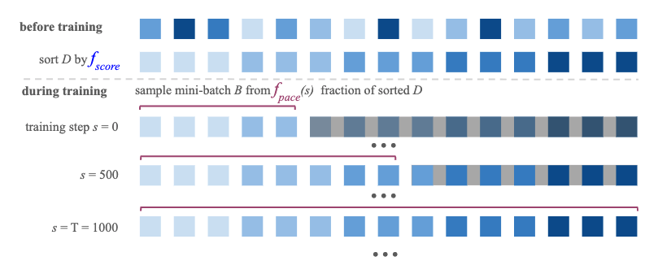

# Curriculum Learning Strategies for IR
## An Empirical Study on Conversation Response Ranking

This code builds upon the [🤗 Transformers](https://github.com/huggingface/transformers) to evaluate curriculum learning strategies for information retrieval. Specifically, the code can be used to fine-tune BERT on conversation response ranking with the option of employing [curriculum learning](https://ronan.collobert.com/pub/matos/2009_curriculum_icml.pdf). We adapted the script _'run_glue.py'_ to receive two main additional parameters:

```
--pacing_function PACING_FUNCTION: str with one of the predefined pacing functions: [linear, root_2, root_5, root_10, quadraticm, geom_progression, cubic, step, standard_training]. You can also modify pacing_functions.py to add your own.
--scoring_function SCORING_FUNCTION_FILE: str with the path of a file with the difficulty score for each instance in the train set. Each line must have just a float score for the training instance at that index in the training file.
```

The framework is based on previous work on curriculum learning and it has two main functions: pacing functions and scoring functions. The scoring functions measure the difficulty of an instance (in our case the query is a dialogue context, i.e. set of previous utterances, and the documents are a set of candidate responses) and the pacing function determines how fast you go from easy to difficult instances during training.

<p align="center">

</p>

This is the code used for the ECIR'20 paper "Curriculum Learning Strategies for IR: An Empirical Study on Conversation Response Ranking". To reproduce the results of the paper it is necessary to download the datasets: [MANtIS](https://guzpenha.github.io/MANtIS/) and [MSDialog](https://ciir.cs.umass.edu/downloads/msdialog/), calculate the scoring functions for each training set with the _'calculate_scoring_function.py'_ script to use the difficulty scores as input for the BERT script (_'run_glue.py'_). To calculate the scoring functions based on BERT, run _'run_glue.py'_ with --save_aps parameter, and use the output files 'losses_' and 'preds_' respectively.

If you have any questions feel free to send me an email.
